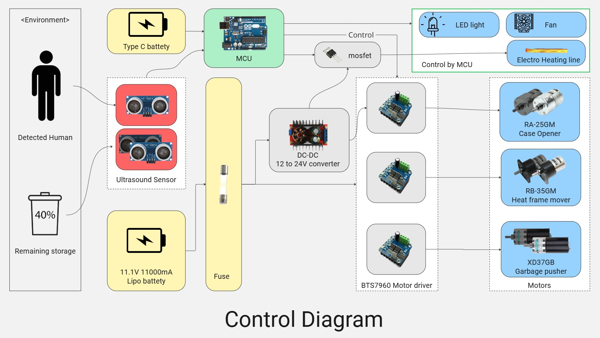
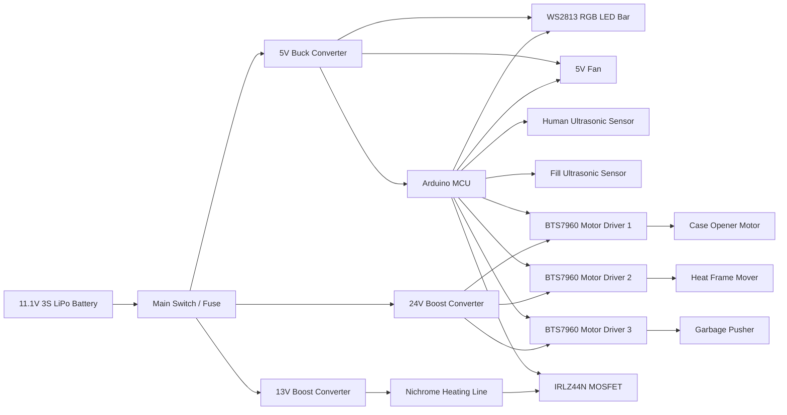

# Smart Auto-Sealing Trash Bin

Arduino 기반 자동 쓰레기 처리 장치 캡스톤 프로젝트입니다. 초음파 센서로 쓰레기 잔량과 사용자 접근을 감지하고(개발 시간이 충분하다면..), 쓰레기가 가득 차면 모터 구동, 니크롬 열선 실링, 배출, 새 봉투 세팅 순서로 동작하도록 설계합니다.

## 주요 기능

- 초음파 센서 기반 사용자 접근 감지 및 쓰레기 잔량 측정
- BTS7960 기반 24V DC 감속모터 제어
- IRLZ44N MOSFET 기반 니크롬 열선 실링 제어
- WS2813 RGB LED 상태 표시 바
- 5V 팬 냉각/배기 제어
- 모터와 열선 동시 작동 방지
- 동시에 최대 2개 모터만 동작하도록 제한
- 모터 최대 작동 시간, 열선 최대 가열 시간 제한
- 시리얼 명령 기반 단계별 테스트

## 시스템 구성

## 전원 구조

| 라인 | 입력 | 출력 | 부하 |
| --- | --- | --- | --- |
| 모터 라인 | 11.1V LiPo | 24V 승압 | BTS7960, DC 감속모터 |
| 열선 라인 | 11.1V LiPo | 약 13V 승압 | 니크롬 열선, IRLZ44N |
| 제어 라인 | 11.1V LiPo | 5V 벅 | Arduino, RGB LED, 팬 |

모든 GND는 반드시 공통 연결해야 합니다. 배터리 -, Arduino GND, 승압/벅 컨버터 GND, BTS7960 GND, MOSFET Source, LED GND가 같은 기준 전위를 가져야 제어 신호가 정상 동작합니다.

## 기본 동작 시퀀스

1. 초음파 센서로 잔량을 주기적으로 측정합니다.
2. 잔량 상태를 RGB LED 색상으로 표시합니다.
3. `BIN_FULL` 상태가 일정 시간 유지되면 자동 처리 시퀀스를 시작합니다.
4. 모터로 봉투/프레임 위치를 제어합니다.
5. 모든 모터를 정지한 뒤 열선을 PWM으로 짧게 가열해 봉투를 실링합니다.
6. 팬을 켜고 냉각 시간을 둡니다.
7. 배출 모터를 구동합니다.
8. 새 봉투 세팅 위치로 모터를 복귀시킵니다.
9. 오류가 없으면 대기 상태로 돌아갑니다.

## 안전 제한

- 열선 작동 중에는 모든 모터를 정지합니다.
- 모터가 하나라도 작동 중이면 열선 가열 요청을 거부합니다.
- 동시에 켤 수 있는 모터 수는 최대 2개입니다.
- 각 모터는 `MAX_MOTOR_RUNTIME_MS`를 넘으면 자동 정지합니다.
- 열선은 `MAX_HEAT_RUNTIME_MS`를 넘으면 자동 차단됩니다.
- 시리얼 `e` 명령으로 즉시 비상정지할 수 있습니다.

## 펌웨어 실행

Arduino IDE에서 [firmware/smart_trash_bin/smart_trash_bin.ino](firmware/smart_trash_bin/smart_trash_bin.ino)를 열고 업로드합니다.

필요 라이브러리:

- `FastLED`

권장 보드:

- Arduino Mega 2560
- Arduino Uno/Nano를 사용할 경우 PWM 핀 수가 부족할 수 있으므로 모터 수, 열선 PWM, LED 핀 배치를 다시 조정해야 합니다.

## 시리얼 테스트 명령

| 명령 | 동작 |
| --- | --- |
| `f` | Motor 1 정방향 |
| `b` | Motor 1 역방향 |
| `g` | Motor 2 정방향 |
| `p` | Motor 3 정방향 |
| `h` | 열선 테스트 |
| `a` | 자동 처리 시퀀스 시작 |
| `s` | 전체 정지 |
| `e` | 비상 정지 |
| `c` | 오류 해제 |
| `0` | 쓰레기통 잔량: 비어 있음 |
| `1` | 쓰레기통 잔량: 중간 |
| `2` | 쓰통 잔량: 거의 참 |
| `3` | 쓰통 잔량: 가득 참 |

## 문서

- [배선 가이드](docs/wiring.md)
- [제어 로직](docs/control-logic.md)
- [테스트 체크리스트](docs/test-checklist.md)
- [부품 정리](docs/bom.md)

## 개발 상태

현재 저장소는 하드웨어 제작 전 단계에서 사용할 수 있는 초기 펌웨어와 문서 골격입니다. 실제 장착 후에는 모터 방향, PWM 값, 초음파 거리 임계값, 열선 가열 시간, 리미트 스위치 입력을 실험값에 맞춰 조정해야 합니다.
