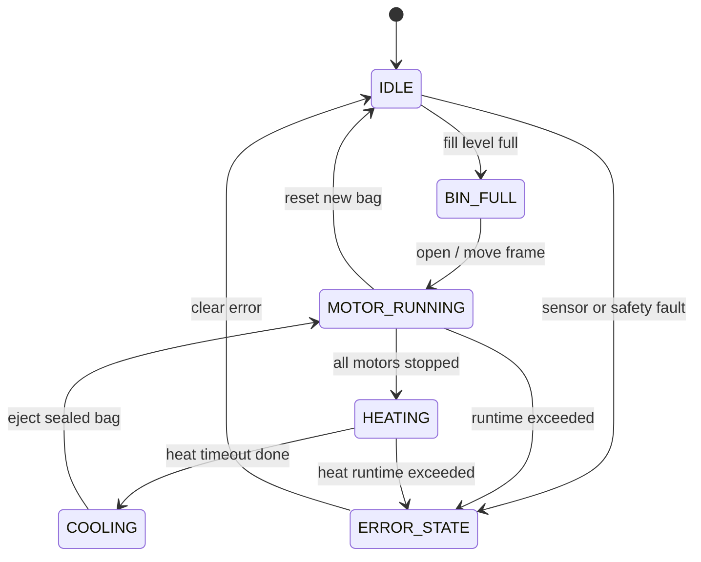

# Control Logic

## 상태 정의

| 상태 | 의미 |
| --- | --- |
| `IDLE` | 대기 |
| `BIN_EMPTY` | 잔량 낮음 |
| `BIN_MEDIUM` | 잔량 중간 |
| `BIN_ALMOST_FULL` | 거의 참 |
| `BIN_FULL` | 가득 참 |
| `MOTOR_RUNNING` | 모터 작동 중 |
| `HEATING` | 열선 작동 중 |
| `COOLING` | 냉각 중 |
| `ERROR_STATE` | 오류 또는 비상 정지 |

## 상호배제 규칙

1. 열선 가열 중에는 모터를 켤 수 없습니다.
2. 모터가 작동 중이면 열선을 켤 수 없습니다.
3. 동시에 동작 가능한 모터 수는 최대 2개입니다.
4. 제한 시간 초과 시 해당 출력은 자동으로 꺼지고 오류 상태로 들어갑니다.

## 자동 처리 시퀀스 초안

실제 기구가 완성되면 각 단계는 리미트 스위치 또는 엔코더 피드백으로 종료하는 것이 가장 안전합니다. 현재 펌웨어는 시간 기반 동작을 기본값으로 둡니다.

## LED 상태 표시

| 조건 | LED 표시 |
| --- | --- |
| 비어 있음 | 초록 |
| 중간 | 노랑 |
| 거의 참 | 주황 |
| 가득 참 | 빨강 점멸 |
| 모터 작동 | 파랑 흐름 |
| 열선 작동 | 주황 |
| 오류 | 보라 점멸 |
